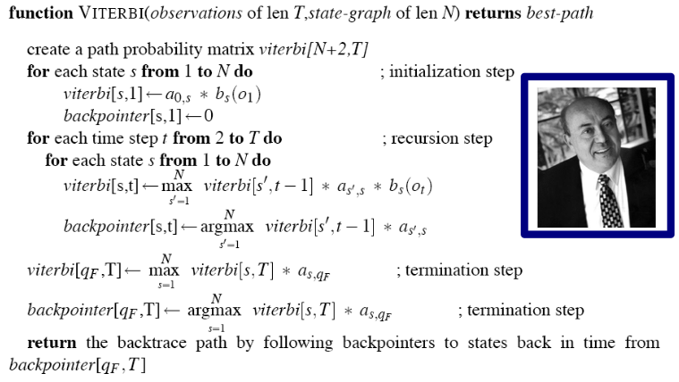

## Pos tagger statistico 

il Pos tagger assegna le part of
speech attraverso un Hidden Markow Model, Il primo passo
quindi è stato quello di calcolare la probabilità di emissione e di transizione per tutte le parole e i
tag presenti nel training set secondo le seguenti formule:

* **Probabilità di emissione:** $P(t_i|t_{i-1}) = \frac{C(t_{i-1},t)}{C(t_{i-1})}$
  
* **Probabilità di transizionne:** $P(w_i|t_{i-1}) = \frac{C(t_i,w_i)}{C(t_i)}$

Il codice riguardante l'implementazione del Pos tagging si trova nella cartella `tagger` del
progetto, in `tagger/hmm.py` sono presenti le funzioni che creano l'hidden markow
model.

`normalize` effettua il calcolo effettivo della distribuzione
di probabilità

```python
def normalize(counts: dict):
    result = {}
    for outer_key, inner_dict in counts.items():
        denom = sum(inner_dict.values())
        result[outer_key] = {
            key: value / denom for key, value in inner_dict.items()
        }
    return result
```

`get_transation_frequencies` Restituisce un dizionario che
contiene i conteggi delle transizioni da un tag all'altro

```python
def get_transition_frequencies(training_set):

    counts = {"Q0": {}}

    for sentence in training_set:
        sentence = [word for word in sentence if not word.is_multiword()]

        counts["Q0"].setdefault(sentence[0].upos, 0)
        counts["Q0"][sentence[0].upos] += 1
        for t1, t2 in zip(sentence, sentence[1:]):
            counts.setdefault(t1.upos, {})
            counts[t1.upos].setdefault(t2.upos, 0)
            counts[t1.upos][t2.upos] += 1
        counts[sentence[-1].upos].setdefault("Qf", 0)
        counts[sentence[-1].upos]["Qf"] += 1

    return normalize(counts)
```

`get_emission_frequencies(training_set)`:  Restituisce un dizionario che
contiene i conteggi delle emissioni di ogni tag presente nel training set 

```python
def get_emission_frequencies(training_set):
    counts = {}

    for sentence in training_set:
        for word in sentence:
            if word.upos is None:
                continue
            counts.setdefault(word.upos, {})
            counts[word.upos].setdefault(word.form, 0)
            counts[word.upos][word.form] += 1

    return normalize(counts)
```

Successivamente abbiamo implementato il pos tagger attraverso l'algoritmo di
Viterbi seguendo lo pseudocodice. 

Un aspetto importante da considerare durante l'implementazione di un  pos tagger sono
le ipotesi di smoothing.
Nel nostro caso abbiamo creato un dizionario a partire dal development set.
Le chiavi del dizionario sono tutti i pos appartenenti alle parole che nel
development set
appaiono  una sola volta. i valori sono distribuzioni di probabilità dove al
numeratore abbiamo le occorrenze dei pos per le parole apparse una sola volta e
al denominatore il numero di parole apparse una sola volta nel development set.
In questo modo, nel caso in cui non siano presenti probabilità di emissione,
effettueremo  i calcoli per tutte le probabilità presenti in questo dizionario. 

```python
# conto occorrenze parole 
    for sentence in development_set:
        for word in sentence:   
            count_dict.setdefault(word.form, 0)
            count_dict[word.form] += 1

    # conto quante volte occorre un pos solo per le parole che appaiono una volta
    for sentence in development_set:
        for word in sentence:
            if count_dict[word.form] == 1 and not word.is_multiword():
                smoothing_dict.setdefault(word.upos, 0)
                smoothing_dict[word.upos] += 1

    # conto quante parole singole ci sono
    single_words = sum(smoothing_dict.values())

    # calcolo le probabilità dividendo per il numero di parole singole
    for key, value in smoothing_dict.items():
        smoothing_dict[key] = value / single_words
  
    return smoothing_dict
```
L'algoritmo di viterbi è stato implementato a partire dal seguente pseudocodice 



```python
    def pos_tag(self, tokens: List[str]):
        transitions, emissions = self.hmm
        default_emissions = smoothing()
        dict_to_add = {}
        backpointer = []

        # prima parola
        viterbi_matrix = [
            {
                pos: transitions["Q0"][pos] * em_value
                for pos, em_value in emissions.get(
                    tokens[0], default_emissions
                ).items()
            }
        ]

        # parole centrali
        for token in tokens[1:]:

            for pos, em_value in emissions.get(
                token, default_emissions
            ).items():

                to_add = [
                    (
                        pos,
                        em_value
                        * transitions.get(previus_pos, {}).get(pos, 0)
                        * previus_value,
                    )
                    for previus_pos, previus_value in viterbi_matrix[
                        -1
                    ].items()
                ]

                value_to_add = max(to_add, key=lambda x: x[1])
                dict_to_add[value_to_add[0]] = value_to_add[1]

                add_to_path = [
                    (
                        previus_pos,
                        previus_value
                        * transitions.get(previus_pos, {}).get(pos, 0),
                    )
                    for previus_pos, previus_value in viterbi_matrix[
                        -1
                    ].items()
                ]

            viterbi_matrix.append(dict_to_add)
            pos_to_add = max(add_to_path, key=lambda x: x[1])
            backpointer.append(pos_to_add[0])
            dict_to_add = {}

        # ultima parola
        to_add = [
            (
                pos,
                previus_value * transitions.get(previus_pos, {}).get("Qf", 0),
            )
            for previus_pos, previus_value in viterbi_matrix[-1].items()
        ]

        value_to_add = max(to_add, key=lambda x: x[1])
        dict_to_add[value_to_add[0]] = value_to_add[1]
        viterbi_matrix.append(to_add)

        add_to_path = [
            (
                previus_pos,
                previus_value * transitions.get(previus_pos, {}).get("Qf", 0),
            )
            for previus_pos, previus_value in viterbi_matrix[-1]
        ]

        pos_to_add = max(add_to_path, key=lambda x: x[1])
        backpointer.append(pos_to_add[0])
        res = list(zip(tokens, backpointer))

        return res
```