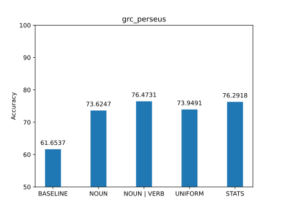

# Introduzione

In questa esercitazione implementiamo e valutiamo un PoS tagger al variare
delle tecniche di smoothing utilizzate. In particolare il PoS tagger utilizzerà
l'Hidden Markov Model come modello e l'algoritmo di Viterbi per il decoding. I
corpus testati saranno due, il primo composto di frasi in greco antico, il
secondo composto di frasi in latino.

# Implementazione

Per implementare il tagger abbiamo creato una classe `HMMTagger` (in
`tagger/hmm_tagger.py`) che ha come attributi le matrici contenenti le
probabilità di transizione ed emissione. Come struttura dati per rappresentare
vettori e matrici abbiamo usato i dizionari. In questo modo non abbiamo
sfruttato la vettorizzazione delle operazioni, ma siamo comunque rimasti
soddisfatti dalla performance dell'algoritmo (aneddoticamente, l'addestramento
e il test su entrambi i corpus richiedono circa 15 secondi sulle nostre
macchine).

## Training


Le probabilità di transizione ed emissione vengono calcolate attraverso
la seguente pipeline:

```python
transitions = pipe(
    corpus.train,
    transition_counts,
    valmap(counts_to_log_probability),
    transpose,
)
```

`corpus.train` è il training set del corpus, che tramite `pipe` viene passato
in successione alle tre funzioni seguenti.

La funzione `transition_counts` non solo conta le transizioni dei PoS presenti
nelle frasi del corpus, ma assegna frequenza 1 anche a tutte le transizioni che
non sono state osservate nel corpus. Questa procedura di smoothing previene
situazioni in cui tutte le probabilità in una colonna della matrice vanno a 0
(quando le emissioni di una parola hanno probabilità positiva solo per certi
tag e le transizioni dal tag precedente verso questi sono 0). Il risultato è un
dizionario annidato, dove `counts[pos1][pos2]` è il numero di transizioni da
`pos1` a `pos2`.

```python
counts = {
  pos: dict.fromkeys([*POS_TAGS, "Qf"], 1) for pos in [*POS_TAGS, "Q0"]
}
```

Per le i conteggi delle emissioni abbiamo proseguito in modo analogo (saltando
lo smoothing, che approcciamo successivamente per gestire le parole non
incontrate nel corpus).

`counts_to_log_probability`[^1] converte un dizionario di conteggi in un
dizionario di probabilità logaritmiche, dividendo ogni conteggio per la somma
di tutti i conteggi nel dizionario.

[^1]: Dato che nel passo precedente della pipeline abbiamo un dizionario
annidato, e vogliamo eseguire questa operazione per tutti i dizionari interni,
usiamo la funzione `valmap(fn, dict)`, dalla libreria `toolz`, che applica `fn`
a tutti i valori di un dizionario. La funzione è curried, per cui saltando
l'ultimo argomento otteniamo una funzione che accetta `dict` ed esegue
`counts_to_log_probability` su ogni dizionario interno.

Infine, `transpose` effettua una trasposizione del dizionario, per rendere più
semplice l'accesso alle probabilità durante il decoding: tramite
`transitions[pos]` possiamo accedere a tutte le probabilità di arrivare a `pos`
da ogni PoS di partenza, mentre con `emissions[token]` otteniamo le probabilità
di generare `token` a partire da ogni PoS.

### Smoothing

Lo smoothing per le emissioni non presenti è stato gestito modificando il
dizionario delle emissioni in modo che `emissions[token]` per un `token` non
incontrato nel training restituisca un dizionario di probabilità scelte
in base alla tecnica di smoothing che si vuole utilizzare. I dizionari di
probabilità per ogni tecnica di smoothing usata sono in `tagger/smoothing.py`.

```python
ALWAYS_NOUN = { 'NOUN': log(1) }

NOUN_OR_VERB = { 'NOUN': log(.5), 'VERB': log(.5) }

UNIFORM = counts_to_log_probability(dict.fromkeys(POS_TAGS, 1))

def probability_of_occurring_once(corpus: Corpus):
    # Conteggi dei PoS dei token che compaiono una sola volta
    # ...
```

## Decoding

L'algoritmo di Viterbi è stato implementato in due funzioni, `pos_tags` e
`_next_col`.

La funzione `pos_tags` è divisa in quattro parti: 

- Inizializzazione: Inizializza la prima colonna della matrice di Viterbi,
  moltiplicando le probabilità di transizione dallo stato iniziale Q0 con
  quelle di emissione del primo token.

- Continuazione: Genera le colonne centrali della matrice chiamando `_next_col` 
  per ogni token 

- Fase finale: Aggiunge la colonna finale della matrice di Viterbi
  moltiplicando l'ultima colonna per le probabilità di transizione allo stato
  finale Qf

- Calcolo path: Effettua il calcolo del path seguendo i backpointer partendo
  dallo stato finale con probabilità massima.

```python
def pos_tags(self, tokens: list[str]):

        transitions, emissions = self.transitions, self.emissions

        # Prima colonna
        viterbi = [sum_values(get_row(transitions, "Q0"), emissions[tokens[0]])]
        backptr = []

        # Colonne centrali 
        for token in tokens[1:]:
            next_viterbi, next_backptr = self._next_col(viterbi[-1], token)
            viterbi.append(next_viterbi)
            backptr.append(next_backptr)

        # Ultima colonna
        viterbi.append(sum_values(viterbi[-1], transitions["Qf"]))

        # Path
        path = [max(viterbi[-1].keys(), key=lambda k: viterbi[-1][k])]
```

Per lavorare con i vettori, abbiamo usato la funzione di utilità `sum_values`,
che somma i valori di due dizionari che hanno la stessa chiave. È da notare che
questa funzione salta i valori che si trovano in un dizionario, ma non
nell'altro. In questo modo possiamo gestire gli zeri: per come abbiamo
calcolato le probabilità, se un elemento non è presente nel corpus, non è
neanche presente nei dizionari di probabilità. Possiamo quindi saltarli dato
che comunque, moltiplicandoli, darebbero zero (nel caso dei logaritmi e della
somma, andremmo a sommare un valore con $-\infty$, ottenendo lo stesso
risultato).

In `_next_col`, calcoliamo il valore di una colonna partendo dalla colonna
precedente e dal token in entrata. Per farlo, andiamo a considerare ogni
PoS[^2] e le probabilità di transizione a quel PoS, e le moltiplichiamo con la
colonna precedente. Otteniamo così un dizionario che contiene come chiavi tutti
i possibili PoS di partenza per arrivare al PoS che stiamo considerando, e come
valori le rispettive probabilità. Scegliamo quindi, dal dizionario ottenuto, la
voce con probabilità più alta, che memorizziamo, e infine moltiplichiamo il
risultato con le probabilità di emissione del token.

[^2]: Ci limitiamo a iterare sui PoS presenti in `emissions[token]`, dato che
gli altri avranno sempre probabilità 0.

```python
def _next_col(self, last_col, token):

    transitions, emissions = self.transitions, self.emissions

    viterbi = {}
    backptr = {}

    for pos in emissions[token].keys():

        # calcolo tutti  i percorsi che vanno  dal pos precedente al pos odierno
        paths_to_pos = sum_values(last_col, transitions[pos])

        # tra tutti i  path scelgo quello con probabilità maggiore
        backptr[pos], viterbi[pos] = max(paths_to_pos.items(), key=lambda it: it[1])

    # crea colonna
    viterbi = sum_values(viterbi, emissions[token])
    
    return viterbi, backptr

```


# Valutazione

La parte di test del programma si trova in `tagger/evaluation.py`. Nella
funzione `main` creiamo una lista di tagger su cui effettuare il calcolo delle
performance, dove ogni tagger utilizza una tecnica di smoothing differente: 

- Considero le parole sconosciute come nomi
- Considero le parole sconosciute come nomi o verbi
- Assegno alle parole sconosciute ogni PoS tag con una probabilità uniforme 
- Assegno alle parole sconosciute le probabilità di emissione delle parole
  che appaiono una volta sola nel corpus

La funzione `test_performance` effettua il calcolo delle performance per ogni
tagger, calcolando le accuracy di ogni tagger nel corpus di riferimento.

Come parte opzionale della consegna, veniva proposto di fare il confronto anche
con un tagger MEMM. Per mancanza di risorse non siamo riusciti a eseguire
l'implementazione proposta sull'intero corpus (poca RAM). Siamo stati in grado
di eseguire il tagger MEMM su di un 10% del corpus latino, e in quel caso nel
test offriva un accuracy di circa il 33%, ma non ci è sembrato un dato
confrontabile con gli altri.

## Performance

{width=70%}

Tagger                          Accuracy
----------------------------  ----------
HMM: 0.5 NOUN, 0.5 VERB           76.46%
HMM: Stats on occurring once      76.27%
HMM: 1/#PosTags                   73.96%
HMM: Always NOUN                  73.62%
Baseline                          61.65%

Sul corpus greco notiamo che la performance media dei tagger HMM è del 75.04%.
La performance migliore è stata ottenuta dal tagger che ha etichettato le
parole sconosciute come nomi o verbi (NOUN|VERB), seguito dal tagger che ha
assegnato alle parole sconosciute i tag delle parole apparse una sola volta nel
corpus (STATS). I tagger NOUN e UNIFORM invece si discostano dagli altri due
ottenendo performance più basse. Tutti i tagger hanno ottenuto prestazioni
migliori rispetto alla baseline.

{width=70%}

Tagger                          Accuracy
----------------------------  ----------
HMM: Stats on occurring once      97.22%
Baseline                          96.83%
HMM: 1/#PosTags                   96.42%
HMM: 0.5 NOUN, 0.5 VERB           96.23%
HMM: Always NOUN                  95.98%

La performance media dei tagger sul corpus latino è del 96.46%. In questo caso
la performance migliore è stata raggiunta dal tagger STATS con il 97,22% di
precisione. Seguono rispetto alle performance il tag UNIFORM, NOUN|VERB e
infine NOUN. Notiamo che il tagger STATS è stato l'unico a superare la
baseline, mentre gli altri tagger hanno avuto performance più basse. 

Possiamo vedere come le performance medie dei tagger sul corpus latino sono
molto più alte rispetto alla media sul corpus greco. La baseline sul corpus
latino allo stesso modo è molto più alta della baseline sul corpus greco. Sul
corpus latino infatti è stato difficile superare la baseline mentre per il
corpus greco è stato molto più semplice. Sul corpus latino La differenza di
accuracy tra la baseline e i tagger che hanno effettuato smoothing è molto
piccola, sul corpus greco invece è molto ampia. Ciò  vuol dire che i tipi di
smoothing utilizzati nel contesto della lingua greca sono stati molto più
funzionali.

## Errori più comuni

\begin{center}
\begin{tabular}{|rll|rll|}
  \multicolumn{3}{c}{Baseline} &
  \multicolumn{3}{c}{HMM: Always NOUN} \\
\hline
   Errori & Corretto   & Predetto   &
   Errori & Corretto   & Predetto   \\
\hline
   16.51\% & VERB       & AUX        &
   48.19\% & PROPN      & NOUN       \\

   16.51\% & DET        & PRON       &
   12.41\% & VERB       & NOUN       \\

   16.12\% & NOUN       & PROPN      &
    8.27\% & VERB       & AUX        \\

   15.73\% & VERB       & PROPN      &
    8.27\% & ADJ        & NOUN       \\

   10.35\% & ADJ        & PROPN      &
    3.31\% & ADV        & CCONJ      \\
\hline
\end{tabular}

\begin{tabular}{|rll|rll|rll|}
  \multicolumn{3}{c}{HMM: 0.5 NOUN, 0.5 VERB} &
  \multicolumn{3}{c}{HMM: 1/\#PosTags} &
  \multicolumn{3}{c}{HMM: Stats on occurring once} \\
\hline
   Errori & Corretto   & Predetto    &
   Errori & Corretto   & Predetto    &
   Errori & Corretto   & Predetto    \\
\hline
   26.87\% & PROPN      & VERB       &
   17.42\% & PROPN      & NOUN       &
   14.65\% & PROPN      & VERB       \\
   24.45\% & PROPN      & NOUN       &
   13.01\% & PROPN      & VERB       &
   11.96\% & VERB       & AUX        \\
    8.81\% & VERB       & AUX        &
    9.41\% & VERB       & AUX        &
   11.51\% & PROPN      & NOUN       \\
    6.06\% & ADJ        & NOUN       &
    5.69\% & PROPN      & DET        &
    7.47\% & VERB       & PROPN      \\
    5.07\% & NOUN       & VERB       &
    3.95\% & PROPN      & PUNCT      &
    5.98\% & ADJ        & PROPN      \\
\hline
\end{tabular}
\end{center}

Dalle tabelle degli errori più comuni per il corpus latino possiamo vedere che
non utilizzando tecniche di smoothing, le percentuali di errore sono abbastanza
uniformi sui PoS. In particolare gli errori sono stati fatti maggiormente su
VERB, DET e NOUN con valori intorno al 16%.

Utilizzando tecniche di smoothing invece gli errori si concentrano maggiormente
su PROPN, con percentuali che vanno dal 14% se utilizziamo la tecnica delle
parole apparse una sola volta, fino al 48% se etichettiamo le parole
sconosciute sempre come NOUN. 

Nella baseline PROPN non è nemmeno elencato tra gli errori più comuni, questo
perché senza effettuare smoothing il tagger tende a etichettare le parole
sconosciute come PROPN.

In generale lo smoothing ha diminuito l'errore su VERB, DET e NOUN ma l'ha
aumentato su PROPN, tant'è che il tagger che ha ottenuto il 48% di errore su
PROPN ha un accuracy al di sotto della baseline.

Vediamo infine che il tagger migliore è quello che ha saputo contenere gli
errori sui nomi propri, l'errore di cui soffrono  di più i tagger che
utilizzano tecniche di smoothing.

\newpage

\begin{center}
\begin{tabular}{|rll|rll|}
  \multicolumn{3}{c}{Baseline} &
  \multicolumn{3}{c}{HMM: Always NOUN} \\
\hline
   Errori & Corretto   & Predetto   &
   Errori & Corretto   & Predetto   \\
\hline
   30.96\% & NOUN       & PROPN      &
   35.67\% & VERB       & NOUN       \\
   24.46\% & VERB       & PROPN      &
   18.63\% & ADV        & PART       \\
   13.87\% & ADV        & PART       &
   15.61\% & ADJ        & NOUN       \\
   10.30\% & ADJ        & PROPN      &
    9.35\% & ADV        & CCONJ      \\
    6.72\% & ADV        & CCONJ      &
    8.63\% & PRON       & ADJ        \\
\hline
\end{tabular}

\begin{tabular}{|rll|rll|rll|}
  \multicolumn{3}{c}{HMM: 0.5 NOUN, 0.5 VERB} &
  \multicolumn{3}{c}{HMM: 1/\#PosTags} &
  \multicolumn{3}{c}{HMM: Stats on occurring once} \\
\hline
   Errori & Corretto   & Predetto    &
   Errori & Corretto   & Predetto    &
   Errori & Corretto   & Predetto    \\
\hline
   20.28\% & ADV        & PART       &
   18.75\% & ADV        & PART       &
   22.68\% & NOUN       & VERB       \\
   14.91\% & NOUN       & VERB       &
   11.00\% & NOUN       & VERB       &
   20.08\% & ADV        & PART       \\
   14.62\% & VERB       & NOUN       &
    8.98\% & VERB       & NOUN       &
    9.44\% & ADV        & CCONJ      \\
   11.90\% & ADJ        & NOUN       &
    8.70\% & ADV        & CCONJ      &
    8.81\% & PRON       & ADJ        \\
    9.73\% & ADV        & CCONJ      &
    8.52\% & ADJ        & NOUN       &
    8.75\% & ADJ        & NOUN       \\
\hline
\end{tabular}
\end{center}

Sul corpus greco la baseline commette errori maggiormente su NOUN e VERB con il
30% su NOUN e 24,5% su VERB. Utilizzando tecniche di smoothing i risultati sono
variabili.

Etichettando le parole sconosciute come nomi, spostiamo gli errori dai nomi ai
verbi. Pur aumentando l'errore sui verbi (35%) commettiamo un errore bassissimo
sui nomi migliorando l'accuracy, infatti si passa dal 61% al 73%. 

Le  performance migliori si ottengono etichettando le parole sconosciute come
nomi o verbi. In questo modo pur peggiorando le prestazioni sugli avverbi,
miglioriamo quelle sui nomi e i verbi raggiungendo l'accuratezza del 76,46%. 

In generale vediamo che con le altre tecniche di smoothing, abbassando l'errore
sui nomi e sui verbi, si alza l'errore sugli avverbi. Il tagger migliore è
quello che ha ottenuto una percentuale più bassa di errore sugli avverbi.

