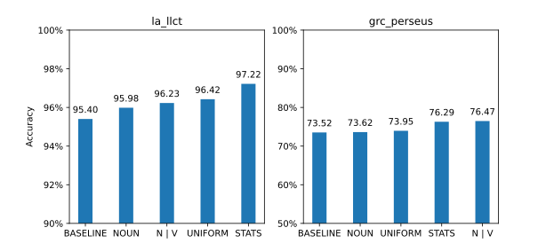

# Introduzione

In questa esercitazione implementiamo e valutiamo un PoS tagger al variare
delle tecniche di smoothing utilizzate. In particolare il PoS tagger utilizzerà
l'Hidden Markov Model come modello e l'algoritmo di Viterbi per il decoding. I
corpus testati saranno due, il primo composto di frasi in greco antico, il
secondo composto di frasi in latino.

# Implementazione

Per implementare il tagger abbiamo creato una classe `HMMTagger` (in
`tagger/hmm_tagger.py`) che ha come attributi le matrici contenenti le
probabilità di transizione ed emissione. Come struttura dati per rappresentare
vettori e matrici abbiamo usato i dizionari. In questo modo non abbiamo
sfruttato la vettorizzazione delle operazioni, ma siamo comunque rimasti
soddisfatti dalla performance dell'algoritmo (l'addestramento e il test su
entrambi i corpus richiedono circa 15 secondi sulle nostre macchine).

## Training


Le probabilità di transizione ed emissione vengono calcolate attraverso
la seguente pipeline:

```python
transitions = pipe(
    corpus.train,
    transition_counts,
    valmap(counts_to_log_probability),
    transpose,
)
```

`corpus.train` è il training set del corpus, che tramite `pipe` viene passato
in successione alle tre funzioni seguenti.

La funzione `transition_counts` non solo conta le transizioni dei PoS presenti
nelle frasi del corpus, ma assegna frequenza 1 anche a tutte le transizioni che
non sono state osservate nel corpus. Questa procedura di smoothing previene
situazioni in cui tutte le probabilità in una colonna della matrice hanno come
risultato 0 (quando le emissioni di una parola hanno probabilità positiva solo
per certi tag e le transizioni dal tag precedente verso questi sono 0). Il
risultato è un dizionario annidato, dove `counts[pos1][pos2]` è il numero di
transizioni da `pos1` a `pos2`.

```python
counts = {
  pos: dict.fromkeys([*POS_TAGS, "Qf"], 1) for pos in [*POS_TAGS, "Q0"]
}
```

Per le i conteggi delle emissioni abbiamo proseguito in modo analogo (saltando
lo smoothing, che approcciamo successivamente per gestire le parole non
incontrate nel corpus).

`counts_to_log_probability`[^1] converte un dizionario di conteggi in un
dizionario di probabilità logaritmiche, dividendo ogni conteggio per la somma
di tutti i conteggi nel dizionario.

[^1]: Dato che nel passo precedente della pipeline abbiamo un dizionario
annidato, e vogliamo eseguire questa operazione per tutti i dizionari interni,
usiamo la funzione `valmap(fn, dict)`, dalla libreria `toolz`, che applica `fn`
a tutti i valori di un dizionario. La funzione è curried, per cui saltando
l'ultimo argomento otteniamo una funzione che accetta `dict` ed esegue
`counts_to_log_probability` su ogni dizionario interno.

Infine, `transpose` effettua una trasposizione del dizionario, per rendere più
semplice l'accesso alle probabilità durante il decoding: tramite
`transitions[pos]` possiamo accedere al dizionario con tutte le probabilità di
arrivare a `pos` da ogni PoS di partenza, mentre con `emissions[token]`
otteniamo le probabilità di generare `token` a partire da ogni PoS.

### Smoothing

Lo smoothing per le emissioni non presenti è stato gestito modificando il
dizionario delle emissioni in modo che `emissions[token]` per un `token` non
incontrato nel training restituisca un dizionario di probabilità scelte
in base alla tecnica di smoothing da usare. I dizionari di probabilità per ogni
tecnica di smoothing sono in `tagger/smoothing.py`.

```python
ALWAYS_NOUN = { 'NOUN': log(1) }

NOUN_OR_VERB = { 'NOUN': log(.5), 'VERB': log(.5) }

UNIFORM = counts_to_log_probability(dict.fromkeys(POS_TAGS, 1))

def probability_of_occurring_once(corpus: Corpus):
    # Conteggi dei PoS dei token che compaiono una sola volta
    # ...
```

## Decoding

L'algoritmo di Viterbi è stato implementato in due funzioni, `pos_tags` e
`_next_col`.

La funzione `pos_tags` è divisa in quattro parti: 

- Inizializzazione: Inizializza la prima colonna della matrice di Viterbi,
  moltiplicando le probabilità di transizione dallo stato iniziale Q0 con
  quelle di emissione del primo token.

- Continuazione: Genera le colonne centrali della matrice chiamando `_next_col` 
  per ogni token 

- Fase finale: Aggiunge la colonna finale della matrice di Viterbi
  moltiplicando l'ultima colonna per le probabilità di transizione allo stato
  finale Qf

- Calcolo path: Effettua il calcolo del path seguendo i backpointer partendo
  dallo stato finale con probabilità massima.

```python
    def pos_tags(self, tokens: list[str]):
        transitions, emissions = self.transitions, self.emissions

        # Prima colonna
        viterbi = [
            sum_values(get_row(transitions, "Q0"), emissions[tokens[0]])
        ]
        backptr = []

        # Colonne centrali
        for token in tokens[1:]:
            next_viterbi, next_backptr = self._next_col(viterbi[-1], token)

            viterbi.append(next_viterbi)
            backptr.append(next_backptr)

        # Ultima colonna 
        viterbi.append(sum_values(viterbi[-1], transitions["Qf"]))

        # Path
        path = [max(viterbi[-1].keys(), key=lambda k: viterbi[-1][k])]
        ... # segui backptr

        return path
```

Le matrici di Viterbi e dei backpointer sono rappresentate come liste di
dizionari, dove ogni dizionario rappresenta una colonna. Per lavorare con i
vettori, abbiamo usato la funzione di utilità `sum_values`, che somma i valori
di due dizionari che hanno la stessa chiave. È da notare che questa funzione
salta i valori che si trovano in un dizionario, ma non nell'altro. In questo
modo possiamo gestire gli zeri: per come abbiamo calcolato le probabilità, se
un elemento non è presente nel corpus, non è neanche presente nei dizionari di
probabilità. Possiamo quindi saltarli dato che comunque, moltiplicandoli,
darebbero zero (nel caso dei logaritmi e della somma, andremmo a sommare un
valore con $-\infty$, ottenendo lo stesso risultato).

In `_next_col`, calcoliamo il valore di una colonna partendo dalla colonna
precedente e dal token in entrata. Per farlo, andiamo a considerare ogni
PoS[^2] e le probabilità di transizione a quel PoS, e le moltiplichiamo con la
colonna precedente. Otteniamo così un dizionario che contiene come chiavi tutti
i possibili PoS di partenza per arrivare al PoS che stiamo considerando, e come
valori le rispettive probabilità. Scegliamo quindi, dal dizionario ottenuto, la
voce con probabilità più alta e la memorizziamo nel backpointer e nella matrice
di Viterbi. Infine moltiplichiamo il risultato con le probabilità di emissione
del token.

[^2]: Ci limitiamo a iterare sui PoS presenti in `emissions[token]`, dato che
gli altri avranno sempre probabilità 0.

```python
    def _next_col(self, last_col, token):

        transitions, emissions = self.transitions, self.emissions

        viterbi = {}
        backptr = {}

        for pos in emissions[token].keys():
            paths_to_pos = sum_values(last_col, transitions[pos])

            # tra tutti i path scelgo quello con probabilità massima
            backptr[pos], viterbi[pos] = max(
                paths_to_pos.items(), key=lambda it: it[1]
            )

        # aggiungo emissioni
        viterbi = sum_values(viterbi, emissions[token])
        return viterbi, backptr
```


# Valutazione

La parte di test del programma si trova in `tagger/evaluation.py`. Nella
funzione `main` creiamo una lista di tagger su cui effettuare il calcolo delle
performance, dove ogni tagger utilizza una tecnica di smoothing differente: 

- Considero le parole sconosciute come nomi
- Considero le parole sconosciute come nomi o verbi
- Assegno alle parole sconosciute ogni PoS tag con una probabilità uniforme 
- Assegno alle parole sconosciute le probabilità dei PoS delle parole che
  appaiono una volta sola nel corpus

La baseline con cui li andiamo a paragonare restituisce sempre il PoS più
frequentemente incontrato nel corpus per ogni parola, e NOUN quando incontra
una parola sconosciuta.

Come parte opzionale della consegna, veniva proposto di effettuare il confronto
anche con un tagger MEMM. Per mancanza di risorse non siamo riusciti a eseguire
l'implementazione proposta sull'intero corpus (poca RAM). Siamo stati in grado
di eseguire il tagger MEMM su di un 10% del corpus latino, e in quel caso nel
test offriva un accuracy di circa il 33%, ma non ci è sembrato un dato
confrontabile con gli altri.

## Performance



Sul corpus greco la performance media dei tagger HMM è del 75.04%.
La performance migliore è stata ottenuta dal tagger che ha etichettato le
parole sconosciute come nomi o verbi (NOUN | VERB), seguito dal tagger che ha
assegnato alle parole sconosciute le probabilità dei PoS delle parole apparse
una sola volta nel corpus (STATS). 

I tagger NOUN e UNIFORM invece si discostano dagli altri due
ottenendo performance più basse. Tutti i tagger hanno ottenuto prestazioni
migliori rispetto alla baseline.

La performance media dei tagger sul corpus latino è del 96.46%. In questo caso
la performance migliore è stata raggiunta dal tagger STATS con il 97,22% di
precisione. 

Seguono rispetto alle performance i tagger UNIFORM, NOUN|VERB e infine NOUN.
Anche in questo caso tutti i tagger HMM hanno superato la baseline.

## Errori più comuni

### Latino

\begin{center}
\begin{tabular}{|rll|rll|}
  \multicolumn{3}{c}{Baseline} &
  \multicolumn{3}{c}{HMM: Always NOUN} \\
\hline
   Errori & Corretto   & Predetto   &
   Errori & Corretto   & Predetto   \\
\hline
   42.10\% & PROPN      & NOUN       &
   48.19\% & PROPN      & NOUN       \\

   11.38\% & VERB       & AUX        &
   12.41\% & VERB       & NOUN       \\

   11.38\% & DET        & PRON       &
    8.27\% & VERB       & AUX        \\

   10.84\% & VERB       & NOUN       &
    8.27\% & ADJ        & NOUN       \\

    7.32\% & ADJ        & NOUN       &
    3.31\% & ADV        & CCONJ      \\
\hline
\end{tabular}

\begin{tabular}{|rll|rll|rll|}
  \multicolumn{3}{c}{HMM: 0.5 NOUN, 0.5 VERB} &
  \multicolumn{3}{c}{HMM: 1/\#PosTags} &
  \multicolumn{3}{c}{HMM: Stats on occurring once} \\
\hline
   Errori & Corretto   & Predetto    &
   Errori & Corretto   & Predetto    &
   Errori & Corretto   & Predetto    \\
\hline
   26.87\% & PROPN      & VERB       &
   17.42\% & PROPN      & NOUN       &
   14.65\% & PROPN      & VERB       \\
   24.45\% & PROPN      & NOUN       &
   13.01\% & PROPN      & VERB       &
   11.96\% & VERB       & AUX        \\
    8.81\% & VERB       & AUX        &
    9.41\% & VERB       & AUX        &
   11.51\% & PROPN      & NOUN       \\
    6.06\% & ADJ        & NOUN       &
    5.69\% & PROPN      & DET        &
    7.47\% & VERB       & PROPN      \\
    5.07\% & NOUN       & VERB       &
    3.95\% & PROPN      & PUNCT      &
    5.98\% & ADJ        & PROPN      \\
\hline
\end{tabular}
\end{center}

Dalle tabelle degli errori più comuni per il corpus latino, possiamo vedere
nella baseline si riscontra una percentuale di errore molto alta sulla
predizione di PROPN. 


Al variare delle tecniche di smoothing, gli errori diminuiscono. Il tagger
Always NOUN, nonostante commetta una quantità di errori su PROPN più alta
rispetto alla baseline (passando dal 42% al 48%), diminuisce gli errori di
predizione su tutti gli altri POS, aumentando comunque l'accuracy.
 
Gli errori più comuni dei tagger UNIFORM e NOUN | VERB sono stati
principalmente due, etichettare i nomi propri come nomi o come verbi. Le
percentuali di errore sono state  comunque molto più basse rispetto alla
baseline arrivando ad un accuracy del 96,23% per NOUN | VERB e 96,42% per
UNIFORM.

Infine, il tagger STATS si è dimostrato il tagger migliore per la lingua latina
in questo esperimento, arrivando a una percentuale del 97,22%. Ciò è in linea
con le aspettative, essendo il tagger che ha utilizzato una tecnica di
smoothing più raffinata rispetto alle altre.

### Greco

\begin{center}
\begin{tabular}{|rll|rll|}
  \multicolumn{3}{c}{Baseline} &
  \multicolumn{3}{c}{HMM: Always NOUN} \\
\hline
   Errori & Corretto   & Predetto   &
   Errori & Corretto   & Predetto   \\
\hline
   35.59\% & VERB       & NOUN       &
   35.67\% & VERB       & NOUN       \\

   20.09\% & ADV        & PART       &
   18.63\% & ADV        & PART       \\

   15.50\% & ADJ        & NOUN       &
   15.61\% & ADJ        & NOUN       \\

    9.73\% & ADV        & CCONJ      &
    9.35\% & ADV        & CCONJ      \\

    7.24\% & PRON       & ADJ        &
    8.63\% & PRON       & ADJ        \\
\hline
\end{tabular}

\begin{tabular}{|rll|rll|rll|}
  \multicolumn{3}{c}{HMM: 0.5 NOUN, 0.5 VERB} &
  \multicolumn{3}{c}{HMM: 1/\#PosTags} &
  \multicolumn{3}{c}{HMM: Stats on occurring once} \\
\hline
   Errori & Corretto   & Predetto    &
   Errori & Corretto   & Predetto    &
   Errori & Corretto   & Predetto    \\
\hline
   20.28\% & ADV        & PART       &
   18.75\% & ADV        & PART       &
   22.68\% & NOUN       & VERB       \\
   14.91\% & NOUN       & VERB       &
   11.00\% & NOUN       & VERB       &
   20.08\% & ADV        & PART       \\
   14.62\% & VERB       & NOUN       &
    8.98\% & VERB       & NOUN       &
    9.44\% & ADV        & CCONJ      \\
   11.90\% & ADJ        & NOUN       &
    8.70\% & ADV        & CCONJ      &
    8.81\% & PRON       & ADJ        \\
    9.73\% & ADV        & CCONJ      &
    8.52\% & ADJ        & NOUN       &
    8.75\% & ADJ        & NOUN       \\
\hline
\end{tabular}
\end{center}

Nella baseline calcolata sul corpus in lingua greca, gli errori più comuni
sono su VERB e ADV con rispettivamente il 35% e il 20% di prevalenza.

I tagger HMM hanno diminuito di molto gli errori effettuati sul PoS VERB, ad
eccezione del tagger Always NOUN. Questo tagger sembra aver aumentato
sensibilmente gli errori su VERB e ADJ diminuendo l'errore compiuto sugli altri
POS.

Il tagger Always NOUN è quello che si discosta meno dalla baseline, ottenendo
un accuracy del 73,62% rispetto al 73,52% della baseline.

Il tagger STATS ha diminuito molto gli errori compiuti su VERB (infatti non è
rappresentato in tabella) ma ha peggiorato le prestazioni sul tag NOUN. In
particolare ha ottenuto un errore del 22,7% su NOUN e ha percentuali simili
anche per ADV. 

Il tagger UNIFORM sembra avere delle percentuali massime di errore più basse
rispetto a tutti i POS, ma questo non l'ha reso il tagger migliore. Anche per
questo tagger, come in STATS, le percentuali di errore più alte sono sui PoS
NOUN e ADV.

Il tagger migliore risulta essere NOUN | VERB la cui percentuale di errore
maggiore è su ADV. Questo tagger ha raggiunto un accuracy molto simile al
tagger STATS, ottenendo una percentuale del 76,47.

In generale abbiamo visto come le percentuali di errore rispetto ai singoli POS
siano diversamente distribuite da una lingua all'altra. Nella lingua latina si
sono riscontrati errori maggiormente sui verbi e sui nomi propri. Per il greco
antico abbiamo ottenuto errori maggiori su verbi, avverbi e aggettivi.

