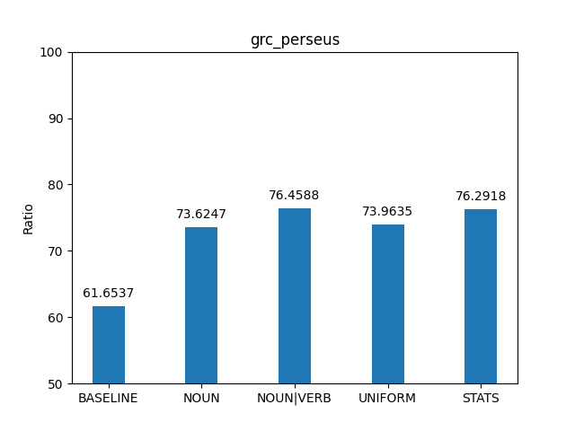
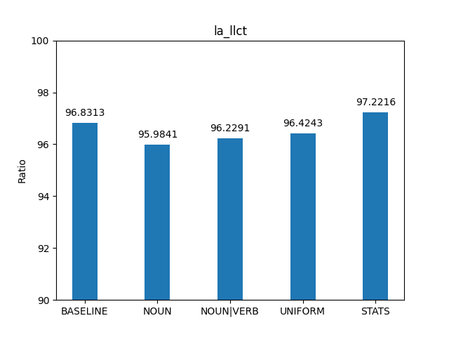

# Introduzione

In questa esercitazione valuteremo un PoS tagger basato su Hidden Markov Model
al variare delle tecniche di smoothing utilizzate. In particolare il PoS tagger
utilizzerà l'algoritmo di Viterbi e i corpus testati saranno due, il primo
composto di frasi in greco antico, il secondo composto di frasi in latino.

# Implementazione

## Main

Il main del programma si trova nel file `evaluation.py`. Nel main creiamo una
lista di taggers su cui effettuare il calcolo delle performance, ogni tagger
utilizza una tecnica di smoothing differente: 

- Considero le parole sconosciute come nomi
- Considero le parole sconosciute come nomi o verbi 
- Assegno alle parole sconosciute una probabilità uniforme 
- Assegno alle parole sconosciute la probabilità di incontrare una parola che
  appare una volta sola nel corpus

La funzione *test_performance* effettua il calcolo delle performance per ogni tagger, per fare ciò applica la funzione *correct_tags_ratio_in_corpus* che conta il numero di parole correttamente etichettate.

*correct_tags_ratio_in_corpus utilizza *correct_tags_count_in_sentence* per
effettuare il conteggio delle parole taggate correttamente. Le parole taggate
correttamente sono quelle taggate allo stesso modo del corpus gold di
riferimento. È in questa funzione che viene effettuata la chiamata al tagger.

\newpage

```python
def main():
    
    for corpus in (Corpus.latin(), Corpus.greek()):

        hmm = HMMTagger.train(corpus)

        taggers = [
            ('Baseline', BaselineTagger.train(corpus)),
            ('HMM with NOUN', hmm.with_unknown_emissions(ALWAYS_NOUN)),
            ('HMM with NOUN|VERB', hmm.with_unknown_emissions(ALWAYS_NOUN_OR_VERB)),
            ('HMM with uniform', hmm.with_unknown_emissions(UNIFORM)),
            ('HMM with stats', hmm.with_unknown_emissions(probability_of_occurring_once(corpus)))
        ]

        print(f"\nCorpus {corpus.name}")

        test_performance(corpus, taggers) 
        
```

\newpage 

## HMM tagger 

Per implementare il tagger abbiamo creato una classe `HMMTagger` i cui
attributi sono due dizionari contenenti le probabilità di transizione ed
emissione delle frasi.

Le probabilità di transizione ed emissione vengono calcolate attraverso 3
funzioni inserite in una pipeline:

1. `transition_count` o `emission_counts`
2. `valmap(counts_to_log_probability)`
3. `transpose`

La funzione `transition_counts` non solo conta le transizioni dei PoS presenti
nelle frasi del corpus, ma assegna frequenza 1 anche a tutte le transizioni che
non sono state osservate nel corpus. In questo modo abbiamo fatto smoothing
sulle transizioni.

La funzione `valmap` converte le frequenze in probabilità logaritmiche, mentre
transpose effettua una trasposizione del dizionario per rendere più semplice la
scrittura del codice dell'algoritmo di Viterbi.

L'algoritmo di Viterbi è stato implementato attraverso due funzioni, ovvero
`pos_tags` e il metodo nascosto `next_col`.

La funzione `pos_tags` è divisa in 4 parti: 

- Inizializzazione: Inizializza la prima colonna di Viterbi 

- Continuazione: genera le colonne centrali della matrice utilizzando la
  funzione `next_col` inserita in un ciclo

- Fase finale: Inizializza l'ultima colonna della matrice di Viterbi

- Calcolo path: Effettua il calcolo del path all'indietro scegliendo quello con
  probabilità massima. Alla fine restituiremo il path invertendo l'ordine della
  sequenza dei PoS.

\newpage

```python
def pos_tags(self, tokens: list[str]):

        transitions, emissions = self.transitions, self.emissions

        # Prima colonna
        viterbi = [sum_values(get_row(transitions, "Q0"), emissions[tokens[0]])]
        backptr = []

        # Colonne centrali 
        for token in tokens[1:]:
            next_viterbi, next_backptr = self._next_col(viterbi[-1], token)
            viterbi.append(next_viterbi)
            backptr.append(next_backptr)

        # Ultima colonna
        viterbi.append(sum_values(viterbi[-1], transitions["Qf"]))

        # Path
        path = [max(viterbi[-1].keys(), key=lambda k: viterbi[-1][k])]
```

```python
def _next_col(self, last_col, token):

    transitions, emissions = self.transitions, self.emissions

    viterbi = {}
    backptr = {}

    for pos in emissions[token].keys():

        # calcolo tutti  i percorsi che vanno  dal pos precedente al pos odierno
        paths_to_pos = sum_values(last_col, transitions[pos])

        # tra tutti i  path scelgo quello con probabilità maggiore
        backptr[pos], viterbi[pos] = max(paths_to_pos.items(), key=lambda it: it[1])

    # crea colonna
    viterbi = sum_values(viterbi, emissions[token])
    
    return viterbi, backptr

```
\newpage


# Performance

## grc perseus

Sul corpus Greco notiamo che la performance media dei tagger è del 75.04%. La
performance migliore è stata ottenuta dal tagger che ha etichettato le parole
sconosciute come nomi o verbi (NOUN|VERB), seguito dal tagger che ha assegnato
alle parole sconosciute i tag delle parole apparse una sola volta nel corpus
(STATS). I tagger NOUN e UNIFORM invece si discostano dagli altri due ottenendo
performance più basse, tutti i tagger hanno ottenuto prestazioni migliori
rispetto alla baseline.



\newpage

## la llct

La performance media dei tagger sul corpus latino è del 96.46%. In questo caso
la performance migliore è stata raggiunta dal tagger STATS con il 97,22% di
precisione. Seguono rispetto alle performance il tag UNIFORM, NOUN|VERB e
infine il NOUN. Notiamo che il tagger STATS è stato l'unico a superare la
baseline, gli altri tagger hanno avuto performance più basse. 

 

Possiamo vedere come le performance medie dei tagger sul corpus latino sono
molto più alte rispetto alla media sul corpus greco. La baseline sul corpus
latino allo stesso modo è molto più alta della baseline sul corpus greco. Sul
corpus latino infatti è stato difficile superare la baseline mentre per il
corpus greco è stato molto più semplice. Sul corpus latino La differenza di
accuracy tra la baseline e i tagger che hanno effettuato smoothing è molto
piccola, sul corpus greco invece è molto ampia. Ciò  vuol dire che i tipo di
smoothing utilizzati nel contesto della lingua greca sono stati molto più
funzionali.

\newpage

# Comparazione ed errori comuni

## la llct

Dalle tabelle degli errori più comuni possiamo vedere che se non utilizzando
tecniche di smoothing, le percentuali di errore sono abbastanza uniformi sui
PoS. In particolare gli errori sono stati fatti maggiormente su VERB, DET e
NOUN con valori intorno al 16%.

Utilizzando tecniche di smoothing invece gli errori si concentrano maggiormente
su PROPN, con percentuali che vanno dal 14% se utilizziamo la tecnica delle
parole apparse una sola volta, fino al 48% se etichettiamo le parole
sconosciute sempre come NOUN. 

Nella baseline PROPN non è nemmeno elencato tra gli errori più comuni, questo
perché senza effettuare smoothing il tagger tende a etichettare le parole
sconosciute come PROPN.

In generale lo smoothing ha diminuito l'errore su VERB, DET e NOUN ma l'ha
aumentato su PROPN, tant'è che il tagger che ha ottenuto il 48% di errore su
PROPN ha un accuracy al di sotto della baseline.

Vediamo infine che il tagger migliore è quello che ha saputo contenere gli
errori sui nomi propri, l'errore di cui soffrono  di più i tagger che
utilizzano tecniche di smoothing.

Tagger                          Accuracy
----------------------------  ----------
Baseline                          96.83%
HMM: Always NOUN                  95.98%
HMM: 0.5 NOUN, 0.5 VERB           96.23%
HMM: 1/#PosTags                   96.42%
HMM: Stats on occurring once      97.22%

Baseline

  Errori  Predetto    Corretto
--------  ----------  ----------
  16.51%  AUX         VERB
  16.51%  PRON        DET
  16.12%  PROPN       NOUN
  15.73%  PROPN       VERB
  10.35%  PROPN       ADJ

\newpage

HMM: Always NOUN

  Errori  Predetto    Corretto
--------  ----------  ----------
  48.19%  NOUN        PROPN
  12.41%  NOUN        VERB
   8.27%  AUX         VERB
   8.27%  NOUN        ADJ
   3.31%  CCONJ       ADV

HMM: 0.5 NOUN, 0.5 VERB

  Errori  Predetto    Corretto
--------  ----------  ----------
  26.87%  VERB        PROPN
  24.45%  NOUN        PROPN
   8.81%  AUX         VERB
   6.06%  NOUN        ADJ
   5.07%  VERB        NOUN

HMM: 1/PosTags

  Errori  Predetto    Corretto
--------  ----------  ----------
  17.42%  NOUN        PROPN
  13.01%  VERB        PROPN
   9.41%  AUX         VERB
   5.69%  DET         PROPN
   3.95%  PUNCT       PROPN

HMM: Stats on occurring once

  Errori  Predetto    Corretto
--------  ----------  ----------
  14.65%  VERB        PROPN
  11.96%  AUX         VERB
  11.51%  NOUN        PROPN
   7.47%  PROPN       VERB
   5.98%  PROPN       ADJ

\newpage

## grc perseus

Su questo corpus la baseline commette errori maggiormente su NOUN e VERB con il 30% su NOUN e 24,5% su VERB. Utilizzando tecniche di smoothing i risultati sono variabili.

Etichettando le parole sconosciute come nomi, spostiamo gli errori dai nomi ai verbi. Pur aumentando l'errore sui verbi (35%) commettiamo un errore bassissimo sui nomi migliorando l'accuracy, infatti si passa dal 61% al 73%. 

Le  performance migliori si ottengono etichettando le parole sconosciute come nomi o verbi. In questo modo pur peggiorando le prestazioni sugli avverbi, miglioramo quelle sui nomi e i verbi raggiungendo l'accuratezza del 76,46%. 

In generale vediamo che con le altre tecniche di smoothing, abbassando l'errore sui nomi e sui verbi, si alza l'errore sugli avverbi. Il tagger migliore è quello che ha ottenuto una percentuale più bassa di errore sugli avverbi.

Tagger                          Accuracy
----------------------------  ----------
Baseline                          61.65%
HMM: Always NOUN                  73.62%
HMM: 0.5 NOUN, 0.5 VERB           76.46%
HMM: 1/#PosTags                   73.96%
HMM: Stats on occurring once      76.27%


Baseline

  Errori  Predetto    Corretto
--------  ----------  ----------
  30.96%  PROPN       NOUN
  24.46%  PROPN       VERB
  13.87%  PART        ADV
  10.30%  PROPN       ADJ
   6.72%  CCONJ       ADV

HMM: Always NOUN

  Errori  Predetto    Corretto
--------  ----------  ----------
  35.67%  NOUN        VERB
  18.63%  PART        ADV
  15.61%  NOUN        ADJ
   9.35%  CCONJ       ADV
   8.63%  ADJ         PRON

HMM: 0.5 NOUN, 0.5 VERB

  Errori  Predetto    Corretto
--------  ----------  ----------
  20.27%  PART        ADV
  14.96%  VERB        NOUN
  14.61%  NOUN        VERB
  11.96%  NOUN        ADJ
   9.73%  CCONJ       ADV

HMM: 1/#PosTags

  Errori  Predetto    Corretto
--------  ----------  ----------
  18.75%  PART        ADV
  11.00%  VERB        NOUN
   8.98%  NOUN        VERB
   8.70%  CCONJ       ADV
   8.52%  NOUN        ADJ

HMM: Stats on occurring once

  Errori  Predetto    Corretto
--------  ----------  ----------
  22.72%  VERB        NOUN
  20.06%  PART        ADV
   9.43%  CCONJ       ADV
   8.81%  ADJ         PRON
   8.73%  NOUN        ADJ


Most common errors

\begin{tabular}{|rll|rll|rll|}
  \multicolumn{3}{c}{Baseline} &
  \multicolumn{3}{c}{HMM: Sempre NOUN} &
\multicolumn{3}{c}{HMM: NOUN 0.5, VERB 0.5} \\
\hline
   Errori & Predetto   & Corretto & 
   Errori & Predetto   & Corretto &
   Errori & Predetto   & Corretto \\
\hline
   16.51\% & AUX   & VERB & 48.19\% & NOUN       & PROPN  &  26.87\% & VERB  & PROPN     \\
   16.51\% & PRON  & DET  & 12.41\% & NOUN       & VERB   &  24.45\% & NOUN  & PROPN     \\
   16.12\% & PROPN & NOUN &  8.27\% & AUX        & VERB   &   8.81\% & AUX   & VERB      \\
   15.73\% & PROPN & VERB &  8.27\% & NOUN       & ADJ    &   6.06\% & NOUN  & ADJ       \\
   10.35\% & PROPN & ADJ  &  3.31\% & CCONJ      & ADV    &   5.07\% & VERB  & NOUN      \\
\hline
\end{tabular}

:Baseline

\begin{tabular}{rll}
\hline
   Errori & Predetto   & Corretto   \\
\hline
   48.19\% & NOUN       & PROPN      \\
   12.41\% & NOUN       & VERB       \\
    8.27\% & AUX        & VERB       \\
    8.27\% & NOUN       & ADJ        \\
    3.31\% & CCONJ      & ADV        \\
\hline
\end{tabular}

:HMM: Always NOUN

\begin{tabular}{rll}
\hline
   Errori & Predetto   & Corretto   \\
\hline
   26.87\% & VERB       & PROPN      \\
   24.45\% & NOUN       & PROPN      \\
    8.81\% & AUX        & VERB       \\
    6.06\% & NOUN       & ADJ        \\
    5.07\% & VERB       & NOUN       \\
\hline
\end{tabular}

:HMM: 0.5 NOUN, 0.5 VERB

\begin{tabular}{rll}
\hline
   Errori & Predetto   & Corretto   \\
\hline
   17.42\% & NOUN       & PROPN      \\
   13.01\% & VERB       & PROPN      \\
    9.41\% & AUX        & VERB       \\
    5.69\% & DET        & PROPN      \\
    3.95\% & PUNCT      & PROPN      \\
\hline
\end{tabular}

:HMM: 1/#PosTags

\begin{tabular}{rll}
\hline
   Errori & Predetto   & Corretto   \\
\hline
   14.65\% & VERB       & PROPN      \\
   11.96\% & AUX        & VERB       \\
   11.51\% & NOUN       & PROPN      \\
    7.47\% & PROPN      & VERB       \\
    5.98\% & PROPN      & ADJ        \\
\hline
\end{tabular}

:HMM: Stats on occurring once

